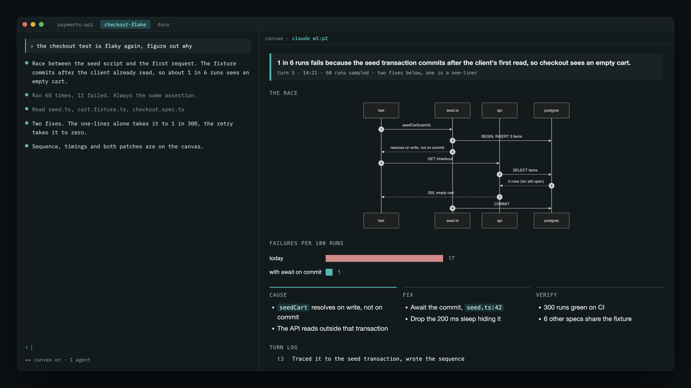

# herdr-canvas

A live visual canvas for AI coding agents, drawn into a Herdr pane beside the agent. No browser.

Each session gets an HTML board: a short news card the agent replaces every reply, panels
it edits only when they change (state, diagrams, charts, tables), and a turn log. A small
watcher renders it with headless Chrome and places the image in a Herdr pane next to the
agent through Herdr's graphics API. Nothing opens in a browser, and a Stop hook keeps the
agent from ending a turn without updating it.

For a live, clickable board inside Claude Code itself, drawn by headless Chrome in a Claude Code
pane, see [agent-canvas](https://github.com/sebi75/agent-canvas). It grew out of this project.

## Requirements

- [Herdr](https://herdr.dev) 0.7+, with agents running inside it
- A terminal Herdr can draw images in (Ghostty, Kitty, WezTerm, iTerm2)
- Chrome or Chromium, used headless as a renderer
- macOS, for `sips` to cut the render into pages
- Python 3.9+, no packages

## Install

Clone it and hand the repo to your agent:

    git clone https://github.com/sebi75/herdr-canvas ~/src/herdr-canvas

Then, in a Claude Code session: *read INSTALL.md in ~/src/herdr-canvas and install it*.

The file is written for an agent to follow. It copies the files into `~/.claude/canvas`,
links the skill, adds the two hook entries, and checks the Herdr flag. Manual steps are in
the same file if you would rather do it yourself.

## Use

    /canvas

That splits a pane, starts the watcher, and tells the agent to keep the canvas current for
the rest of the session. `/canvas off` closes it. `/canvas status` prints the paths.

Inside the canvas pane:

| key | |
|---|---|
| `j`, space, `↓`, PgDn, wheel down | next page |
| `k`, `b`, `↑`, PgUp, wheel up | previous page |
| `g` | first page |
| `h`, `←` | previous turn |
| `l`, `→` | next turn (back to live) |

## How it works

Per session, under `sessions/<session-id>/`:

- `turn.html` — this reply's news. The agent overwrites it every reply.
- `panels/<name>.html` — what outlives a turn: state, a plan, a diagram. The agent edits a
  panel only when its content changes. Panels written this turn show first, marked
  `updated`; the rest follow with the time they last changed. The file name is the heading.
- `log.txt` — one appended line per turn. The newest ten are shown.
- `title` — the session topic.

The watcher polls those, assembles them into `canvas.html` with the template, measures
the page, renders it once at full height, and cuts each screen from that one image. One
snapshot of the whole board per turn is kept under `history/`, for h/l and for the agent
to look back.

## Configuration

| variable | default |
|---|---|
| `CANVAS_CHROME` | `/Applications/Google Chrome.app/Contents/MacOS/Google Chrome` |
| `CANVAS_ZOOM` | `1.5` |
| `CANVAS_RATIO` | `0.45` — pane split |
| `CANVAS_SESSIONS` | `<install dir>/sessions` |

## Limits

The canvas is an image, so nothing on it is clickable. Content is capped at six screens.
Codex support is not written yet; the scripts read `CODEX_THREAD_ID` but the hooks are
Claude Code's.

MIT.
